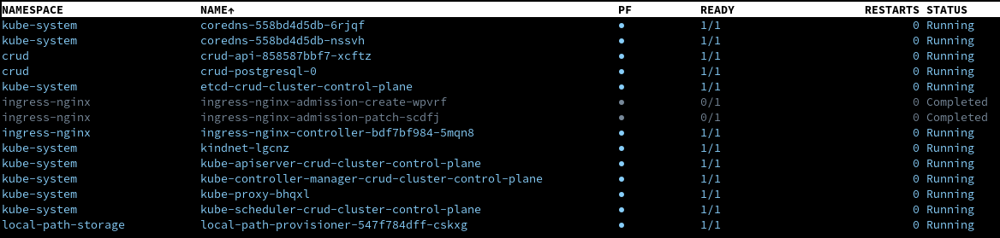
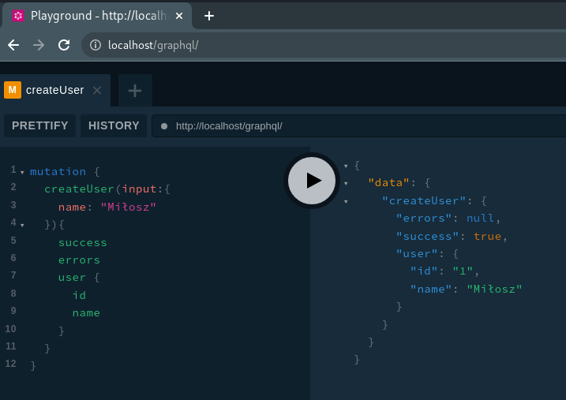

## Użyte narzędzia

- kind v0.11.1 (https://kind.sigs.k8s.io/docs/user/quick-start)
- kustomize v4.5.4 (https://kubectl.docs.kubernetes.io/installation/kustomize/)
- kubectl v1.22.2
- helm v3.6.3

## Start lokalnego środowiska (budowanie obrazów)

```console
docker-compose -f docker-compose.yaml up -d --build
```

Można dodać lokalny wpis w /etc/hosts

```console
echo "127.0.1.1         api.example.com" >> /etc/hosts
```

Wypychanie zbudowanego obrazu do repo

```console
docker-compose push
```

## Stop lokalnego środowiska

```console
docker-compose down
```

## Stop i usunięcie volumenu bazy

```console
docker-compose down -v
```

## Przykładowe requesty


#### Dodawanie użytkownika

```graphql
mutation {
  createUser(input: { name: "Nazwa użytkownika" }) {
    success
    errors
    user {
      id
      name
    }
  }
}
```

#### Edycja nazwy użytkownika

```graphql
mutation {
  updateUser(input: { id: 1, name: "Inna nazwa użytkownika" }) {
    success
    errors
    user {
      id
      name
    }
  }
}
```

#### Usuwanie użytkownika

```graphql
mutation {
  deleteUser(id: 1) {
    success
    errors
  }
}
```

#### Wyświetlenie użytkownika po ID

```graphql
query {
  showUser(id: 1) {
    success
    errors
    user {
      id
      name
    }
  }
}
```

#### Wyświetlanie wszystkich użytkowników

```graphql
query {
  showUsers {
    success
    errors
    users {
      id
      name
    }
  }
}
```

## Start lokalnego klastra k8s

```console
cd /k8s
sh kind-cluster.sh
```

#### Budowanie aplikacji

```console
cd /kustomize
kustomize build --enable-helm| kubectl apply -f-
```

#### Dostęp do klienta w przeglądarce po adresie

```console
localhost/graphql
```

## Efekt: Pody chodzą, UI działa :D

1. Pody</br>
   
2. Klient w przeglądarce</br>
   

#### Pora usunąć klaster

```console
kind delete cluster --name crud-cluster
```
